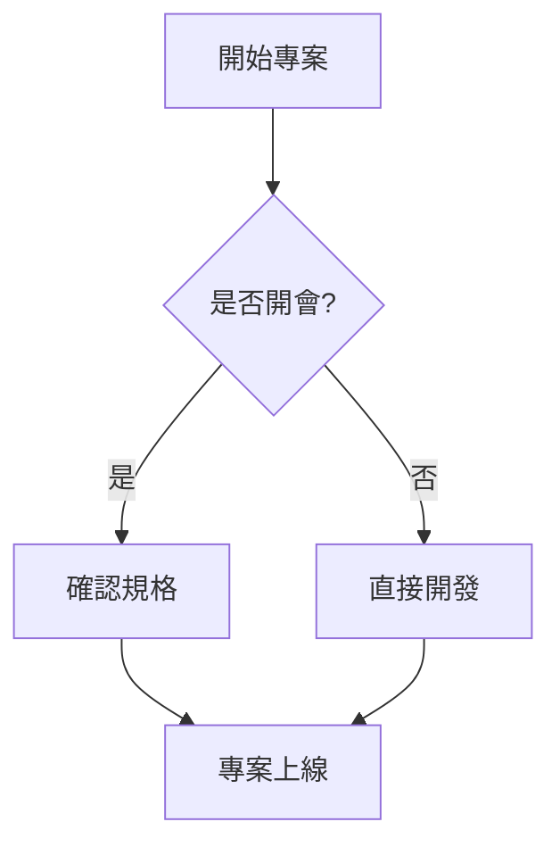

# 🧱 Obsidian 語法核心全集

## 1. Obsidian 特有核心功能

### 雙向連結 (Backlinks)
* 連結到現有筆記：[[筆記名稱]]
* 連結並自訂顯示文字：[[筆記名稱|點擊這裡檢視]]
* 連結到筆記內的特定標題：[[筆記名稱#章節名稱]]
* 連結到特定段落 (區塊)：[[筆記名稱^區塊代碼]]

### 嵌入檔案 (Embeds)
* 嵌入整篇筆記內容：![[被嵌入的筆記]]
* 嵌入圖片並調整寬度：![[image.png|300]]
* 嵌入錄音或影片：![[recording.mp3]]

### 標籤 (Tags)
* 普通標籤：#工作 #學習
* 階層式標籤：#專案/2026/Q2 

---

## 2. 筆記管理與元數據 (YAML Frontmatter)
> 必須放在筆記的最頂端（第一行）

```yaml
---
aliases: [別名1, 別名2]
tags: [專案, 封存]
date: 2026-06-29
status: 進行中
---
```

---

## 3. 進階視覺排版

### 提示框 (Callouts)
Obsidian 內建多種精美的提示框樣式：
> [!blank] 
> 這是一個最簡單的純文字框。
> 它會保留預設的底色與邊框，但不會有任何圖示，非常適合用來凸顯某段文字。


> [!note] 筆記提示框
> 這是一個標準的隨手筆記。

> [!info] 資訊提示框
> 用於補充重要背景資訊。

> [!todo] 待辦事項提示框
> 提醒自己接下來要做的事情。

> [!warning] 警告提示框
> 注意！此操作可能具有風險。

> [!error] 錯誤提示框
> 發生錯誤，請立即檢查。

> [!success] 成功提示框
> 恭喜，專案已順利完成！

### 摺疊區塊 (Collapsible Callouts)
> [!faq]+ 點擊可以展開或摺疊問題？
> 沒錯！在類型後面加上 `+` 預設為展開，加上 `-` 預設為摺疊。

---

## 4. 任務與動態圖表

### 互動式待辦清單 (Task Lists)
* [ ] 尚未完成的任務
* [/] 進行中的任務 (部分主題支援)
* [x] 已完成的任務
* [-] 已取消的任務 (部分主題支援)

### Mermaid 流程圖與甘特圖
Obsidian 原生支援繪製圖表：



---

## 5. 學術與專業格式

### 數學公式 (LaTeX)
* **行內公式**：質能方程式 $E = mc^2$ 非常經典。
* **獨立公式區塊**：
$$
\sum_{i=1}^{n} i = \frac{n(n+1)}{2}
